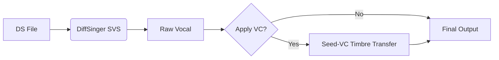

# **Lyric Rewriting & Singing Voice Synthesis System**  
*A Professional Toolchain for AI-Powered Vocal Editing and Synthesis*  

---

## **0. System Setup Guide**

### **0.1 Environment Preparation**

**Hardware Requirements:**

- NVIDIA GPU (≥16GB VRAM recommended)
- CUDA 11.7+ and cuDNN 8.7+

**Installation Steps:**

```bash
# Create conda environment
conda create -n songedit python=3.10 -y
conda activate songedit

# Install dependencies
pip install torch==2.0.1+cu117 --extra-index-url https://download.pytorch.org/whl/cu117
pip install onnxruntime-gpu --extra-index-url https://aiinfra.pkgs.visualstudio.com/PublicPackages/_packaging/onnxruntime-cuda-12/pypi/simple/
pip install -r requirements.txt

# Install audio processing libs
conda install -c conda-forge ffmpeg libsndfile
```

### **0.2 Model Checkpoints**

Download pretrained models from HuggingFace:

```bash
# Install huggingface_hub if needed
pip install huggingface_hub

# Download all checkpoints
python -c "
from huggingface_hub import snapshot_download
snapshot_download(repo_id='badd9yang/songedit', local_dir='checkpoints')
"

# Expected folder structure:
checkpoints/
├── step1/
│   ├── separate_model.pt
│   ├── whisper/
│   ├── ...
│   └── align.ckpt
└── step2/
    ├── whisper-small/
    ├── model_v1.pt
    └── model_v2.pt
  
```

> **Note:** For manual download, get models from [HuggingFace Repo](https://huggingface.co/badd9yang/songedit/tree/main)


## **1. Core Features Overview**  

### **1.1 Song Editing Pipeline**  
Transform raw audio into customizable singing performances with:  
✔ **Vocal Separation** – Isolate vocals from accompaniment  
✔ **Lyric Transcription** – Automatic lyric recognition via Whisper ASR  
✔ **Time-Alignment** – Precise phoneme-level synchronization (MFA-based)  
✔ **Singing Voice Synthesis** – DiffSinger-powered singing generation  
✔ **Voice Conversion** – Timbre modification via Seed-VC  

---

## **2. Technical Implementation**

### **2.1 Audio Preprocessing & Alignment**  

#### **Workflow Steps**  
1. **Input Preparation**  
   - Place vocal+accompaniment audio in `/data/input_data`  
   - System automatically:  
     - Extracts clean vocals  
     - Segments into 3-30s clips (VAD-based)  
     - Generates time-aligned lyrics (Whisper + MFA)  

2. **Feature Extraction**  
   - Outputs DS-format files containing:  
     - Phoneme sequences  
     - Duration/pitch contours  
     - Linguistic features  

3. **User Interaction**  
   ```python
   # Initialize processing module
   import os
   from songedit.songedit import *
   
   os.environ["CUDA_VISIBLE_DEVICES"] = "0"
   
   model = SongEdit(
           separate_model_path= "checkpoints/step1/separate_model.pt",
           asr_model_path= "checkpoints/step1/whisper",
           align_model_path= "checkpoints/step1/align.ckpt",
           spk_dia_model_path= "checkpoints/step1",
           vad_model_path= "checkpoints/step1/vad.onnx",
   )
   ```

---

### **2.2 Lyric Editing Interface**  

**Code Implementation:**  

```python
import os
os.environ["CUDA_VISIBLE_DEVICES"] = "0"

from songedit.songedit import *
from songedit.svc import ReplaceLyrics

proofread = Proofreading("checkpoints/step1/align.ckpt")
proofread.process("data/your_proofreading_path",
              "data/your_proofreading_temp_save_path")

lyric_editor = ReplaceLyrics()
lyric_editor.process(
    "your_proofread.ds",
    "your_modified_lyrics.txt",
    "save_modified.ds"
)
```

---

## **3. Singing Voice Synthesis Engine**  

### **3.1 Multi-Stage Synthesis Pipeline**  


#### **Advanced Controls**  
```python
# Full synthesis+conversion with pitch adaptation
from songedit.svc import *
model = SingingVoiceSynthesis(
        "checkpoints/step2/model_v1.pt",
        "checkpoints/step2/model_v2.pt",
        "checkpoints/step2/whisper-small/")

model(
    ds_file_path="song.ds",
    out_path="result.wav",
    ref_wav_path="target_voice.wav",
    pitch_shift_svs=12,    # +1 octave during synthesis
    pitch_shift_svc=-12,   # Normalize pitch post-VC
    diffusion_steps=100,   # Higher = better quality
    mode="svs_svc"        # Pipeline selection
)
```

---

## **4. Professional Mixing Tools**  

### **4.1 Vocal-Accompaniment Blending**  
Industry-standard processing chain:  
1. **EQ Matching** – Reduce frequency clashes  
2. **Sidechain Compression** – Dynamic vocal emphasis  
3. **Spatial Enhancement** – Convolution reverb  
4. **Loudness Optimization** – Mastering-grade limiting  

**Usage Example:**  
```python
model.combine(
    gen_vocal="ai_vocal.wav",
    accomp="instrumental.wav",
    out_path="mixed.wav",
    vocal_volume=0.7,              # 70% vocal prominence
    time_stamps=[(1.2, 2.5)],      # Timbre modification regions
)
```

---

## **5. System Capabilities**  

### **Development Progress**  
✅ **Vocal Isolation** – State-of-the-art separation  
✅ **Lyric-to-Audio Alignment** – <5ms phoneme precision  
✅ **Neural Singing Synthesis** – 44.1kHz studio quality  
✅ **Real-Time Voice Conversion** – <500ms latency  

### **Roadmap**  
🔜 **DiffSinger Acoustic new version** – Flow Matching architecture (3× faster)  

🔜 **add DiffSinger Variance Model** – Style Controllable 

🔜 **ONNX Export** – Cross-platform deployment  

---

## **6. Acknowledgments**  
We extend gratitude to the open-source community:  
- **DiffSinger** – Neural singing synthesis  
- **SOFA** – Industrial-grade alignment  
- **Seed-VC** – Zero-shot voice conversion  

---

**📌  Last Updated: May 2025**   

> *"From raw audio to professional vocal production – all in one pipeline."*  

[Contact Support](yangchen@hccl.ioa.ac.cn) | [GitHub Repository](github.com/badd9yang) | [API Reference](diffsinger.com) 
